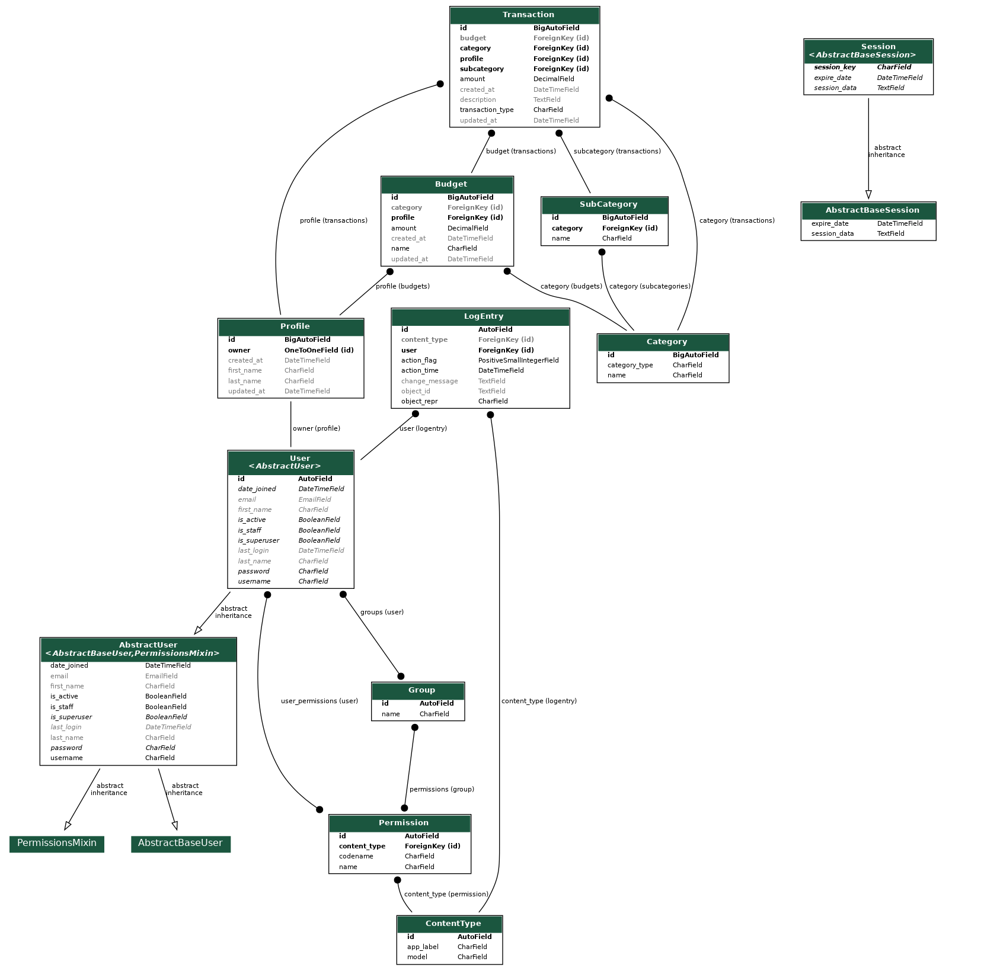

# Budget

- This is the README for the Back-end API - other information can be found in the Front-end repository documentation [here](https://github.com/NiborGnu/budget-frontend).

## Project Overview

- A Django Rest Framework API was made, connected to a PostgreSQL database and deployed to Heroku before being connected to a React application in order to create the website "Budgets".

## Agile methodology

- Please see [front-end documentation](https://github.com/NiborGnu/budget-frontend/blob/main/README.md).
- Project board can be found [here](https://github.com/users/NiborGnu/projects/13).

## Back-end documentation

### ERD

  
Click to view the ERD

  

### Database

1. Go to [neon.tech](https://console.neon.tech/realms/prod-realm/protocol/openid-connect/auth?client_id=neon-console&redirect_uri=https%3A%2F%2Fconsole.neon.tech%2Fauth%2Fkeycloak%2Fcallback&response_type=code&scope=openid+profile+email&state=xHteyudNuLsqjskuiH8L8g%3D%3D%2C%2C%2C).
2. Create account and follow the steps provided to create a PostgreSQL database and deploy with provided url.

### Deployment

Please see separate [DEPLOYMENT.md](./DEPLOYMENT.md) file for full deployment steps.

### Testing

Please see separate [TESTING.md](./TESTING.md) file for all testing.

## Languages

- Python

## Technologies used

- Django REST Framework connects the Front-end to the Back-end.
- Neon PostgreSQL Database server was used to store budgets, transactions, categories and user.
- Gunicorn is a Python WSGI HTTP server which was used to run the Django application on Heroku in production.
- Requirements
  - asgiref==3.8.1
  - Django==5.1.2
  - django-cors-headers==4.6.0
  - django-environ==0.11.2
  - djangorestframework==3.15.2
  - djangorestframework-simplejwt==5.3.1
  - gunicorn==23.0.0
  - psycopg2==2.9.10
  - PyJWT==2.9.0
  - sqlparse==0.5.1
  - whitenoise==6.8.2

## Credits

- The Code Institute DRF API walkthrough was used to learn the basics and more.
- [Coding with Lewis](https://www.youtube.com/@CodingWithLewis) for great tutorials.
- [Codemy.com](https://www.youtube.com/@Codemycom) for great tutorials.
