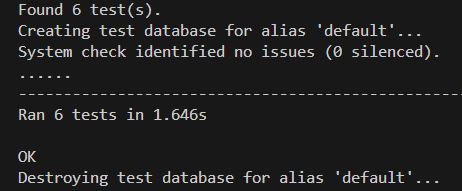

# TESTING

## Validators

### Python

- [PEP8](https://pep8ci.herokuapp.com/) was used to test python files.
- All returned clear.
- 

## Automated Tests

- [Tests Users](https://github.com/NiborGnu/budget-my-life-api-backend/blob/main/users/tests.py)
- 

- [Tests Transactions](https://github.com/NiborGnu/budget-my-life-api-backend/blob/main/transactions/tests.py)
- 

- [Tests Categories](https://github.com/NiborGnu/budget-my-life-api-backend/blob/main/categories/tests.py)
- 

- [Tests Budgets](https://github.com/NiborGnu/budget-my-life-api-backend/blob/main/budgets/tests.py)
- 

## Bugs

No bugs found.
